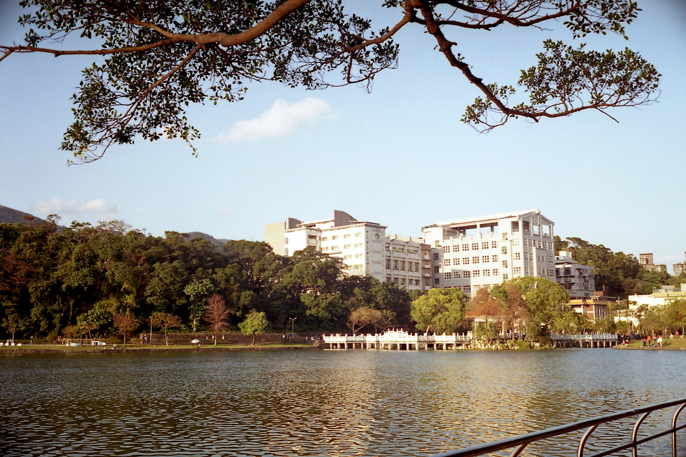

# Hello! I'm [Alan Wang](https://alankrantas.github.io/)👋

Technical writer (software/IT-related) based in Taipei, Taiwan. ([LinkedIn](https://www.linkedin.com/in/alankrantas/))

### Professional Competencies

- Writing and refining technical, marketing, educational or documentation content
- Translating (English to/from Traditional Chinese)
- Software engineering (entry to proficient level in frontend, backend, container/cloud, embedded programming/IoT, practical machine learning, etc.)

### Official Projects

- [LOC Documentation](https://loc-documentation.vercel.app/) for [FST Network](https://www.fst.network/) (Aug 2022 - Jul 2024)

### Open Source Project Contributions

- Half a dozen sensor/display drivers for [TinyGo Drivers](https://github.com/tinygo-org/drivers)
- A few extensions for [micro:bit MakeCode (PXT)](https://makecode.microbit.org/extensions)

> The chances of finding out what’s really going on in the universe are so remote, the only thing to do is hang the sense of it and keep yourself occupied.
> 
> --- _The Hitchhiker's Guide to the Galaxy_
