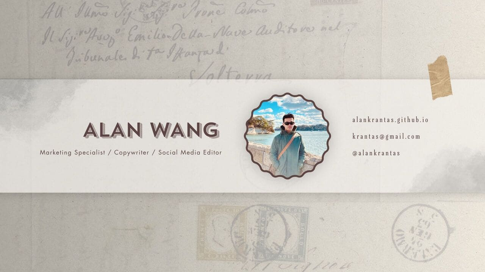

# Hello! I'm Alan Wang ✍️

I have diverse experience in media, publishing, education, luxury fashion and information technology sectors, with primary professional skills in writing, editing and translation, including article/advertorial writing, copywriting, technical writing and social media content creation/editing, photography and video making. Published ~60 long-form works (translated, edited and authored).

I had experience and skills in software engineering, embedded system prototyping as well as practical machine learning/deep learning, but currently not maintained up-to-date.

I was also an amateur classical piano player, analog film photography hobbyist and STEM Maker enthusiast. I have self-taught basic mechanical watch movement servicing and already successfully repaired/serviced several vintage watches.

- [Homepage](https://alankrantas.github.io/) ([repo](https://github.com/alankrantas/alankrantas.github.io))
- [LinkedIn](https://www.linkedin.com/in/alankrantas/)
- [Published titles and written works](https://github.com/alankrantas/alankrantas/blob/main/works/published.md)

- Personal lists:
  - [Vintage Collections](https://github.com/alankrantas/alankrantas/blob/main/notes/vintage-collection.md)
  - [Vintage User Manuals and Documents](https://github.com/alankrantas/alankrantas/blob/main/notes/vintage-manuals.md)

---

[Github profile repo](https://github.com/alankrantas/alankrantas)
